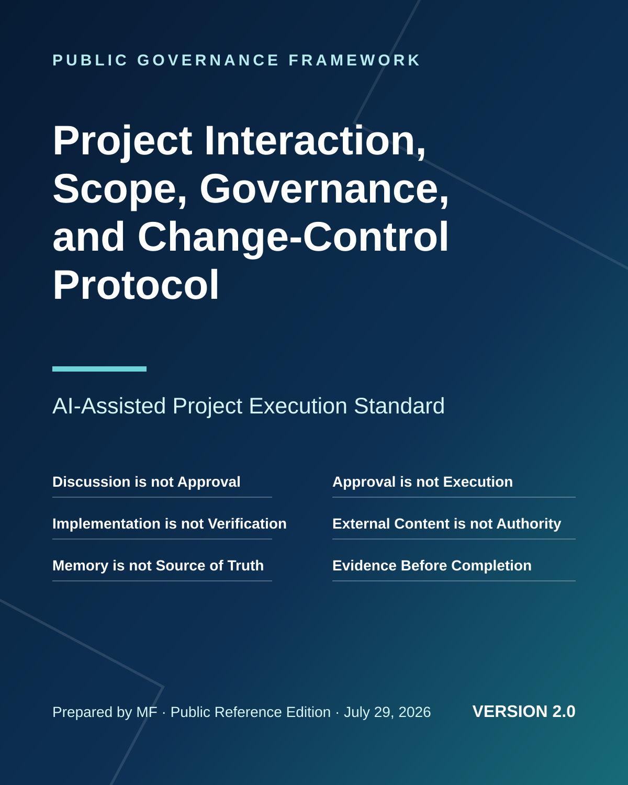

  

# Project Interaction, Scope, Governance, and Change-Control Protocol

**Version 2.0 — AI-Assisted Project Execution Standard**  
**Public Reference Edition · Prepared by MF · July 29, 2026**

AI-assisted projects can drift when questions are mistaken for decisions, recommendations are treated as approvals, or approved ideas are executed beyond their intended scope. This public framework establishes disciplined controls for project interaction, scope protection, decision management, change authorisation, execution safety, traceability, verification, rollback, and continuity.

> **Discussion is not approval. Approval is not execution. Implementation is not verification. Verification is not acceptance.**

## Read or download

- **[Open the complete PDF](AI_Project_Governance_Protocol_v2.0.pdf)**
- **[Direct public PDF link](https://raw.githubusercontent.com/mfdigisol-creator/ai-project-governance-protocol/main/AI_Project_Governance_Protocol_v2.0.pdf)**
- **[Read the complete protocol as Markdown](PROTOCOL.md)**

## What the protocol covers

- Default Information Mode and explicit command classification
- Authority, approval, and source-of-truth controls
- Canonical roadmap, requirements, architecture, and baseline protection
- Formal and simplified change-control paths
- Risk-tiered execution and irreversible-action safeguards
- External-content, prompt-injection, and tool-output trust controls
- Duplicate-execution, verification, rollback, and recovery mechanisms
- Decision, assumption, risk, issue, and traceability registers
- Multi-session, multi-agent, checkpoint, and context-integrity controls
- Cross-project isolation and evidence-based completion reporting

## Quick command model

| Intent | Command | Effect |
|---|---|---|
| Ask without changing the project | `QUESTION:` | Informational only |
| Analyse without applying | `ANALYZE:` | Informational only |
| Present a candidate change | `PROPOSE:` | Not approved or applied |
| Approve a controlled change | `APPROVE CHANGE CR-###:` | Decision approval only |
| Execute a bounded change | `EXECUTE CR-### IN [ENVIRONMENT]:` | Authorised implementation |
| Verify implementation | `VERIFY CR-###:` | Assurance action |
| Resume controlled work | `RETURN TO WORK ITEM WP-###:` | Project navigation |
| Preserve authoritative state | `CHECKPOINT:` | Continuity record |

## Use note

This is a general governance framework. Adapt it to the project’s complexity, authority model, security sensitivity, technical environment, contractual obligations, and applicable laws or regulations. Written governance improves control but does not replace competent human oversight, access controls, testing, or professional legal and security advice where required.

## Publication architecture

This repository is the authoritative public landing page and distribution source. The PDF is stored directly in the public repository and can be opened or downloaded without authentication.

GitHub Pages automation is intentionally disabled because this GitHub account’s Pages configuration inherits an unrelated commercial custom domain. Keeping publication on the dedicated repository preserves cross-project and brand isolation.
